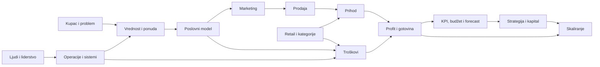
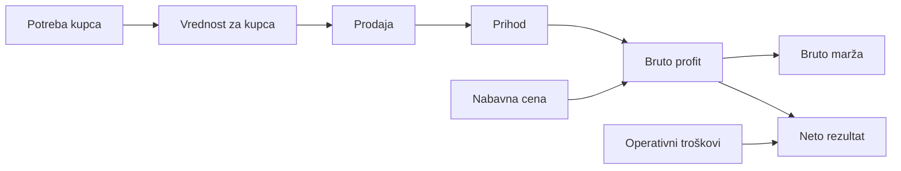

# CMO OS Knowledge Graph

Status: `active`  
Graph version: `1.0`  
Last updated: `2026-08-18`

## Svrha

Knowledge Graph pokazuje kako su trajni poslovni koncepti povezani. On ne čuva Aleksandrove ocene, snage ili slabosti; lični learning state postoji samo u `10_Daily/Learning_Progress.md`.

## Status koncepta

| Status | Značenje |
|---|---|
| `planned` | Koncept postoji u curriculum planu, ali još nije obrađen. |
| `introduced` | Koncept je objašnjen u aktivnoj ili završenoj lekciji. |
| `documented` | Postoji proverena trajna definicija u Knowledge bazi. |

Status koncepta opisuje Knowledge bazu, ne nivo Aleksandrovog znanja.

## Mapa poslovnog sistema

Ova mapa prikazuje zavisnost: rast bez kupca, profitne ekonomike, operacija i ljudi nije održivo skaliranje.

## Trenutno obrađeni koncepti — Lesson 001

Veze na grafu ne zamenjuju formule. Tačne definicije i formule postoje u `Business_Glossary.md` i relevantnim Knowledge dokumentima.

## Registar čvorova

| Concept ID | Koncept | Domain | Status | Canonical definition | Introduced by |
|---|---|---|---|---|---|
| KG-CUS-001 | Potreba kupca | Customer | `introduced` | Lesson 001; zaseban Knowledge dokument još ne postoji | Lesson 001 |
| KG-CUS-002 | Vrednost za kupca | Customer | `introduced` | Lesson 001; zaseban Knowledge dokument još ne postoji | Lesson 001 |
| KG-FIN-001 | Prihod | Finance | `documented` | `Business_Glossary.md` | Lesson 001 |
| KG-FIN-002 | Nabavna cena | Finance | `documented` | `Business_Glossary.md` | Lesson 001 |
| KG-FIN-003 | Bruto profit | Finance | `documented` | `Business_Glossary.md` | Lesson 001 |
| KG-FIN-004 | Bruto marža | Finance | `documented` | `Business_Glossary.md` | Lesson 001 |
| KG-FIN-005 | Operativni troškovi | Finance | `introduced` | Lesson 001; detaljna klasifikacija dolazi u Lesson 102 | Lesson 001 |
| KG-FIN-006 | Neto profit / rezultat | Finance | `documented` | `Business_Glossary.md`; detaljnije u Level 1–2 | Lesson 001 |

## Registar veza

| From | Relation | To | Objašnjenje | Status |
|---|---|---|---|---|
| Potreba kupca | pokreće tražnju za | Vrednost za kupca | Kupovina počinje problemom ili željenim ishodom. | `introduced` |
| Vrednost za kupca | omogućava | Prodaja | Ponuda mora kupcu pružiti razlog za razmenu novca. | `introduced` |
| Prodaja | stvara | Prihod | Prihod nastaje kada se roba ili usluga proda. | `introduced` |
| Prihod + nabavna cena prodate robe | određuju | Bruto profit | Bruto profit je prihod umanjen za direktni trošak prodate robe. | `documented` |
| Bruto profit + prihod | određuju | Bruto marža | Bruto marža pokazuje koji deo prihoda ostaje kao bruto profit. | `documented` |
| Bruto profit + ostali troškovi | utiču na | Neto rezultat | Bruto profit nije konačna zarada kompanije. | `introduced` |

## Pravila održavanja

1. Novi čvor se dodaje kada se koncept prvi put stvarno obradi, ne samo zato što se nalazi u katalogu budućih lekcija.
2. Svaki čvor ima stabilan `Concept ID`, domain, status i canonical definition.
3. Nova veza mora imati poslovno objašnjenje i izvor u lekciji ili Knowledge dokumentu.
4. Knowledge status se ne koristi kao studentska ocena.
5. Posle završene lekcije ažuriraju se čvorovi i veze, a lični dokaz znanja ide isključivo u `10_Daily/Learning_Progress.md`.
6. Ako je veza sporna ili zavisi od konteksta, označava se kao `[ASSUMPTION]` ili `[UNKNOWN]` dok se ne proveri.

