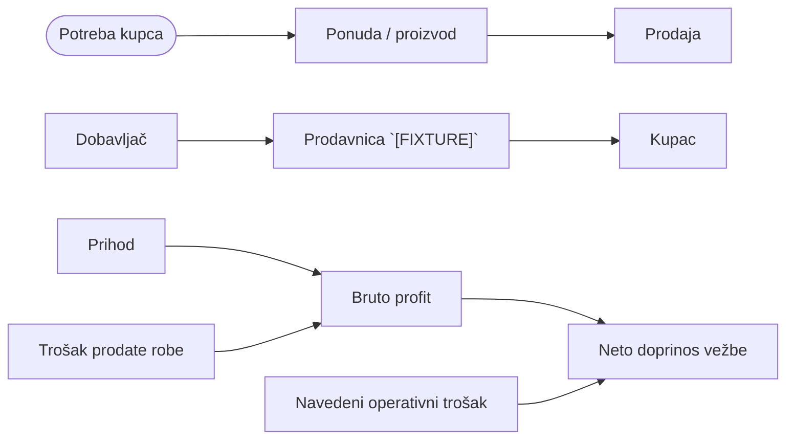

# Lesson 001 — Kako kompanija stvara prihod, trošak i profit

status: `AUTHORED`  
level: `0 — Poslovna orijentacija`  
prerequisite: `Nema`  
evidence_mode: `[FIXTURE]`

> `AUTHORED` znači da sadržaj postoji i auditiran je za učenje. Ne znači `ACTIVE` ili `COMPLETED`; personal learning state postoji samo u `10_Daily/Learning_Progress.md`.

## Learning objective

Razlikuje vrednost za kupca, prihod, bruto profit i neto rezultat, i objašnjava zašto veći promet nije automatski bolji posao.

## Teach & explain

Kupac ne kupuje proizvod, nego rešenje svog problema. Firma naplati tu vrednost i time nastaje prihod. Prihod nije zarada: iz njega se prvo plaća roba koja je prodata.

Ono što ostane posle direktnog troška je bruto profit. Iz bruto profita se pokrivaju plate, zakup, marketing i dostava — tek posle toga postoji neto profit. Zato menadžer ne slavi promet, nego pita koliko je od tog prometa zaista ostalo.

## Visual model

1. Tok vrednosti: potreba kupca → ponuda/proizvod → prodaja
2. Tok robe: dobavljač → prodavnica → kupac
3. Most rezultata: prihod − trošak prodate robe = bruto profit
4. Neto doprinos vežbe: bruto profit − navedeni operativni trošak

Uređiva FigJam verzija: [Tok stvaranja poslovnog rezultata](https://www.figma.com/board/x23fVAXvKPru3yFCAHeGlY).

Napomena: Figma/FigJam je verifikovana vizuelna integracija, ali nije source of truth. Kreiranje ili menjanje spoljnog dijagrama zahteva eksplicitno odobrenje; poslovne činjenice i odluke ostaju u CMO OS-u.

## New terms

- **Vrednost za kupca / Customer value:** Korist i rešeni problem zbog kojih kupac bira ponudu.
- **Prihod / Revenue:** Vrednost prodaje pre bilo kakvog odbitka.
- **Nabavna cena, trošak prodate robe / Cost of goods sold:** Direktni trošak baš onog proizvoda koji je prodat.
- **Bruto profit / Gross profit:** Prihod umanjen za direktni trošak prodate robe.

## Realistična `[FIXTURE]` simulacija — Prodaja telefona u prodavnici tehnike

Prodavnica tehnike prodaje telefon kupcu koji traži pouzdan uređaj za posao. Na tu prodaju je pojednostavljeno pripisan i deo operativnih troškova.

### Evidence contract

- **Source / method:** CMO OS original authored simulation
- **Period / as-of:** N/A — simulirani scenario
- **Grain / population:** jedna simulirana prodaja uređaja
- **Unit / currency:** RSD i %
- **VAT / tax basis:** sve vrednosti na istoj osnovi; PDV efekat nije modelovan
- **Inclusions:** samo eksplicitno navedeni ulazi
- **Exclusions:** stvarni Tehnocentar/PostHog podaci i sve nenavedene stavke
- **Assumptions:** nema povrata, reklamacije ni popusta; operativni trošak je pojednostavljeno pripisan jednoj prodaji
- **Formula / denominator:** Bruto profit = 60.000 − 50.000 = 10.000 RSD; bruto marža = 10.000 ÷ 60.000 = 16,7%; posle 3.000 RSD operativnog troška ostaje 7.000 RSD.

### Inputs

- prodajna cena 60.000 RSD
- nabavna cena 50.000 RSD
- operativni trošak vezan za prodaju 3.000 RSD
- 1 prodata jedinica

### Decision

Pitati da li 10.000 RSD bruto profita pokriva pripadajuće operativne troškove, umesto slaviti 60.000 RSD prometa.

### Expected result

Promet i zarada su jasno razdvojeni, pa odluka o ceni i dodacima ima osnovu.

## Common mistake

- **Pogrešno:** „Prodali smo za 60.000 RSD, znači zaradili smo 60.000 RSD.“
- **Ispravno:** 60.000 RSD je prihod; zarada te prodaje je 10.000 RSD bruto profita, i to pre operativnih troškova.

## Practical exercise

Laptop se prodaje za 90.000 RSD uz nabavnu cenu 78.000 RSD i 4.000 RSD pripisanih operativnih troškova.

1. Izračunaj prihod, bruto profit, bruto maržu i ono što ostaje posle operativnog troška.
2. Da li je 90.000 RSD zarada kompanije? Objasni jednom rečenicom.
3. Predloži jedan etičan način da se profit te kupovine poveća bez spuštanja cene laptopa.

**Rešenje za proveru:** prihod 90.000 RSD; bruto profit 12.000 RSD; bruto marža 12.000 ÷ 90.000 = 13,3%; posle operativnog troška ostaje 8.000 RSD.

**Kriterijum prihvatanja:** odgovor mora zadovoljiti sva četiri principa iz rubrike ispod. Otvoreni deo zadatka ocenjuje mentor; automatski test u aplikaciji proverava razumevanje principa, ne sam zadatak.

## Business scenario

Prodavnica ima dve ponude, a kupac zaista želi masku i cena paketa mu je prihvatljiva:

| Ponuda | Prihod | Nabavna cena | Bruto profit |
|---|---:|---:|---:|
| A: samo telefon | 60.000 RSD | 50.000 RSD | 10.000 RSD |
| B: telefon + korisna maska | 63.000 RSD | 51.000 RSD | 12.000 RSD |

Koja ponuda je bolja i zašto? Odgovor mora razdvojiti vrednost za kupca, prihod i bruto profit.

## Discussion questions

1. Zašto prodavnica nekad prodaje popularan proizvod sa nižom maržom?
2. Kako dodatna oprema može promeniti profit kupovine, a da kupac ipak dobije veću vrednost?
3. Koja je opasnost ako menadžer prati samo prihod?

## Assessment rubric

Automatski test u aplikaciji proverava znanje, račun/dokaz, primenu i poslovnu odluku sa po tri pitanja po oblasti; oblast nosi 25 poena. Očekivani principi:

1. Prihod je vrednost prodaje, a bruto profit je prihod umanjen za direktni trošak prodate robe.
2. U primeru su bruto profit 10.000 RSD, bruto marža 16,7% i preostalih 7.000 RSD posle navedenog operativnog troška.
3. Vrednost kupovine se povećava korisnim dodatkom uz jasno objašnjenu vrednost i slobodan izbor kupca, ne skrivenom stavkom na računu.
4. Veći promet nije automatski bolji rezultat: bira se opcija koja povećava bruto profit uz stvarnu vrednost za kupca.

Canonical prolaz zahteva najmanje 80/100, najmanje 15/25 u svakoj oblasti, demonstriranu primenu, obrazloženu odluku i ispravljene ključne greške.

## Sources and limits

- CMO OS originalna sinteza · bez prepisivanja knjiga
- Korpus: `BKB-VAL-006` (Pet delova svakog biznisa) · BK-014 pp. 61, 194–196 · BK-006 za čitanje izveštaja

Knjige su sekundarni izvori. Ova lekcija je originalna CMO OS sinteza i ne kopira dostavljene knjige.

## Lesson completion

Status: `AUTHORED` / `ACTIVE` je dozvoljeno tek nakon potvrđenog evidence-a u `10_Daily/Learning_Progress.md`.

## Knowledge storage

Nakon potvrđenog testa, praktične primene i obrazložene odluke mentor ažurira samo `10_Daily/Learning_Progress.md`, a trajne veze koncepata u `01_Knowledge/Knowledge_Graph.md`.

## Mentor instructions

Koristi tok Teach → Explain → Example → Practice → Test → Feedback → Apply → Document. Sve brojke u ovoj lekciji su `[FIXTURE]`; ne predstavljaju stvarne Tehnocentar podatke. Ne upisuj napredak bez proverljivog evidence-a.
