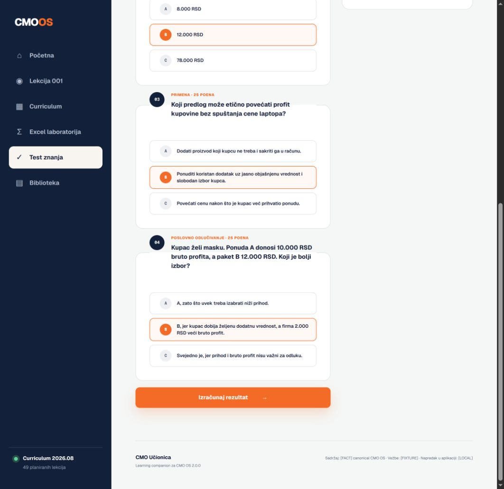
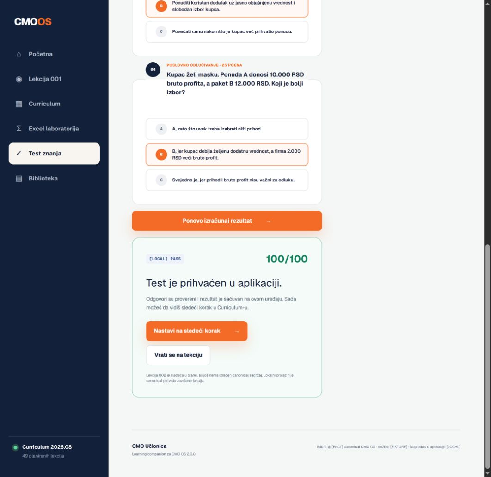
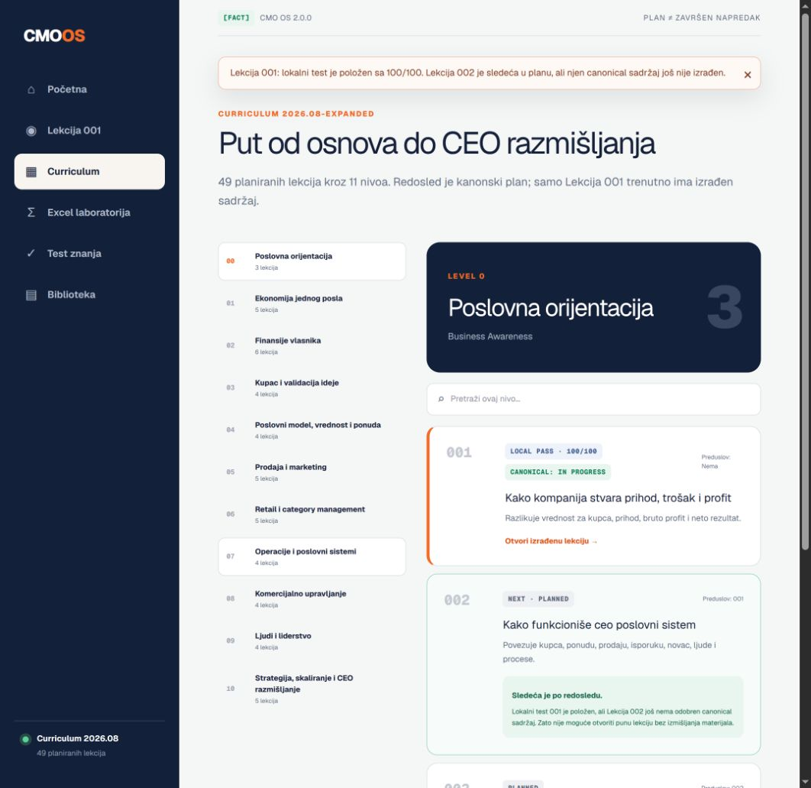
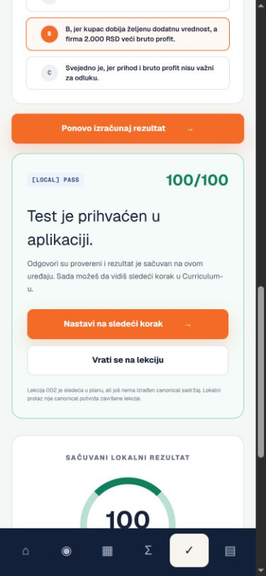

# Test Completion Flow Audit

Date: `2026-08-22`  
System version: `CMO-OS 2.0.0`  
Scope: Lesson 001 automatic test completion, result acknowledgment, local progress persistence and transition to the next curriculum step  
Action class: user-authorized `EXECUTE` through a browser annotation on the live application  
Verdict: `APPROVE`

## Audit scope

- `[FACT]` The learner selected all four correct answers and the application stored `100/100` locally.
- `[FACT]` The original result panel was positioned near the top of the right column while the learner finished at the bottom of the form.
- `[FACT]` The learner's goal was to receive an unmistakable pass confirmation and understand how to continue.
- `[UNKNOWN]` Lesson 002 has a canonical catalog entry but no approved lesson body. The application must not fabricate it or mark it available.

## Step 1 — Original completion state

Health: `REVISE`

- `[FACT]` The score was saved as `100/100`, but the current viewport showed the selected answers, the old `Izračunaj rezultat` button and an empty right column.
- **HIGH — Result acknowledgment was outside the user's viewport.** Impact: a successful submission appeared ignored even though the application had stored the result.
- **MEDIUM — The call to action did not communicate completion.** Impact: the learner could not tell whether to click again or navigate elsewhere.
- **MEDIUM accessibility risk — Focus stayed on the submit control.** A screen-reader or keyboard user did not receive a focused completion region at the point where state changed.

## Step 2 — Pass confirmation after correction

Health: `PASS`

- `[FACT]` The application now renders a completion card immediately below the submit button with `[LOCAL] PASS`, `100/100` and `Test je prihvaćen u aplikaciji.`
- `[FACT]` The primary action is `Nastavi na sledeći korak`; the secondary action returns to Lesson 001.
- `[FACT]` The completion region receives focus, uses `role="status"` and `aria-live="polite"`, and respects reduced-motion preference when scrolling into view.
- `[FACT]` A `75/100` attempt shows `REVISE`, removes the next-step action and provides routes back to the lesson and laboratory.

## Step 3 — Curriculum transition

Health: `PASS_WITH_CANONICAL_LIMIT`

- `[FACT]` Lesson 001 is labeled `LOCAL PASS · 100/100` and separately `CANONICAL: IN PROGRESS`.
- `[FACT]` Lesson 002 is highlighted as `NEXT · PLANNED` with its catalog outcome and an explicit explanation that its canonical body is not yet authored.
- `[FACT]` This separation acknowledges the learner's result without promoting browser-local state into `10_Daily/Learning_Progress.md`.
- `[UNKNOWN]` A full transition into Lesson 002 remains blocked by missing canonical content, not by application navigation.

## Step 4 — Mobile completion state

Health: `PASS`

- `[FACT]` The completion card and both actions reflow to one column at `390 × 844`.
- `[FACT]` Browser measurement returned no horizontal overflow: document and body width `375`, viewport width `390`.
- `[FACT]` The fixed mobile navigation remains visible and does not cover the primary completion action.

## Functional verification

| Check | Result |
|---|---|
| Four correct answers | `100/100` |
| Immediate pass confirmation | `PASS` |
| Result-region focus | `test-completion`, `role=status`, `aria-live=polite` |
| 75-point revision path | `PASS` |
| Restore to 100 points | `PASS` |
| Persistence after reload | `PASS` |
| Persistent next-step action | `PASS` |
| Curriculum local/canonical separation | `PASS` |
| Mobile overflow | `PASS` |
| TypeScript | `PASS` |
| ESLint | `PASS` |
| Production build | `PASS` |
| Dependency audit | `0 vulnerabilities` |

## External execution evidence

- System: `OpenAI Sites`
- Deployment time: `2026-08-22T19:38:02Z`
- Method: pushed source commit, locally built Sites archive, saved version 4 and public production deployment
- Production verification: browser navigation to the public URL, stored `100/100` detection, visible next-step control and Curriculum transition inspection
- Quality: deployment status `succeeded`; public access remained active; no authentication gate appeared
- Limitation: screenshots and semantic inspection support this bounded flow audit but do not prove full WCAG conformance

## Final gate

`APPROVE` — the implemented test-completion flow now clearly acknowledges the score, preserves the local result, exposes the next action and truthfully stops at the missing canonical Lesson 002 body.

No canonical learning completion, Knowledge Graph update or personal Learning Progress write was performed.
